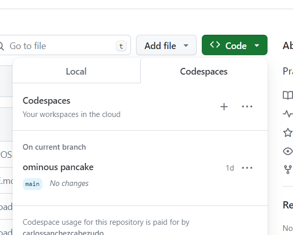

# Práctica 1: Entorno de desarrollo

El objetivo principal de la práctica es preparar el equipo con el fin de poder hacer las futuras prácticas. A lo largo de esta práctica se adquerirá también ciertas nociones de cómo usar Git y Github.
## Git y Github
### Proceso de creación del repositorio y workplace a utilizar
Se debe crear el repositorio y codespace desde nuestro perfil. A continuación se adjunta una imagen del repositorio (es decir, el espacio de almacenamiento) utilizado (la foto se realiza una vez hecho el fork posterior):
#### Repositorio creado:

A su vez, se adjunta una imagen del apartado del repositorio desde donde se puede crear el codespace que ha sido utilizado durante la práctica.
#### Codespace:

Una vez hecho todo esto, se hace un fork del repositorio con el fin de crear una copia de dicho repositorio (que es ajeno) en nuestra propia cuenta de GitHub. Es una técnica muy utilizada pues aporta seguridad, la capacidad de experimentar sin que los cambios afecten directamente al repositorio original y facilita la colaboración. Se crea desde el botón "Fork" de la esquina superior de la pantalla como se muestra en la siguiente imagen:
#### Creación fork:

### Comandos git básicos
Para responder a las cuestiones planteadas acerca de los comandos git básicos, he considerado pertinente crear el archivo [git.pdf](https://github.com/carlossanchezcabezudo/p1-fork/blob/main/git.pdf) para facilitar la interpretación de esta memoria

## Descargas del entorno de desarrollo
En lo que se refiere a la instalación de los softwares pertinentes, he creado de nuevo un archivo [entorno.pdf](https://github.com/carlossanchezcabezudo/p1-fork/blob/main/entorno.pdf) donde se puede verificar la correcta descarga y funcionamiento de los softwares pedidos.
Carlos Sánchez-Cabezudo Pinto

